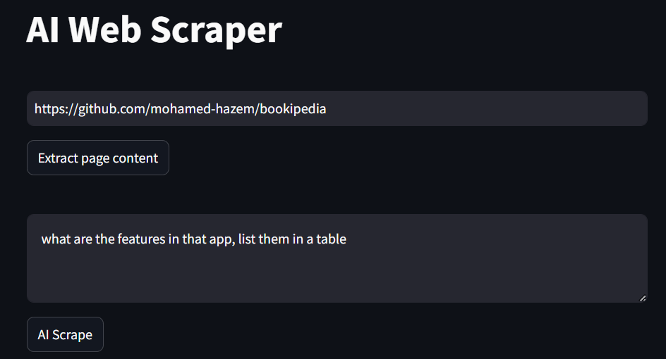
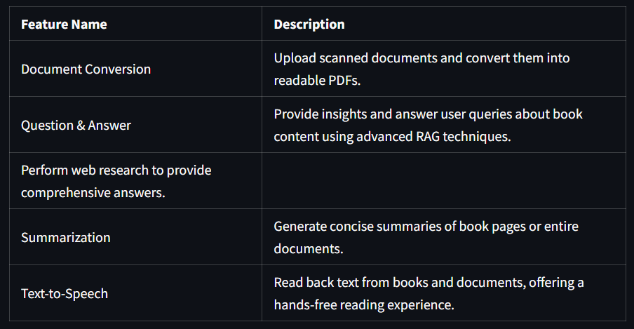

<div align="center">

# AI Web Scraper

This project is an intelligent web scraper that extracts content from an HTML page, processes it, and sends it to a language model (LLaMA 3.2) for targeted extraction based on a provided description.

</div>

## How It Works
1. **HTML Extraction:** The scraper fetches the HTML content of a specified web page. 
2. **Chunking Process:** The HTML is split into chunks to fit within the token limits of the language model.
3. **LLaMA 3.2 Processing:** The chunks are sent to the LLaMA 3.2 model, along with a description (e.g., "Extract product prices"), and the model processes each chunk.
4. **Response Generation:** The LLaMA model returns the scraped data based on the description.

## Setup and Installation
1. Clone the repository:
```
git clone https://github.com/mohamed-hazem/ai-web-scraper.git
cd ai-web-scraper
```
2. Install dependencies:
```
pip install -r requirements.txt
```
3. Download and Install [Ollama](https://ollama.com/download) | [github](https://github.com/ollama/ollama):

4. Download **llama3.2** -> *3B Parameters* 
```
ollama pull llama3.2
```

5. Run the application:
```
streamlit run app.py
```
## Usage
1. Provide the URL of the webpage to scrape.
2. Enter a description of what data to extract (e.g., "Extract the top news headlines").
3. The app will extract the page content, split it into chunks, and send each chunk to the LLaMA 3.2 model to generate the response.

## Screenshots


